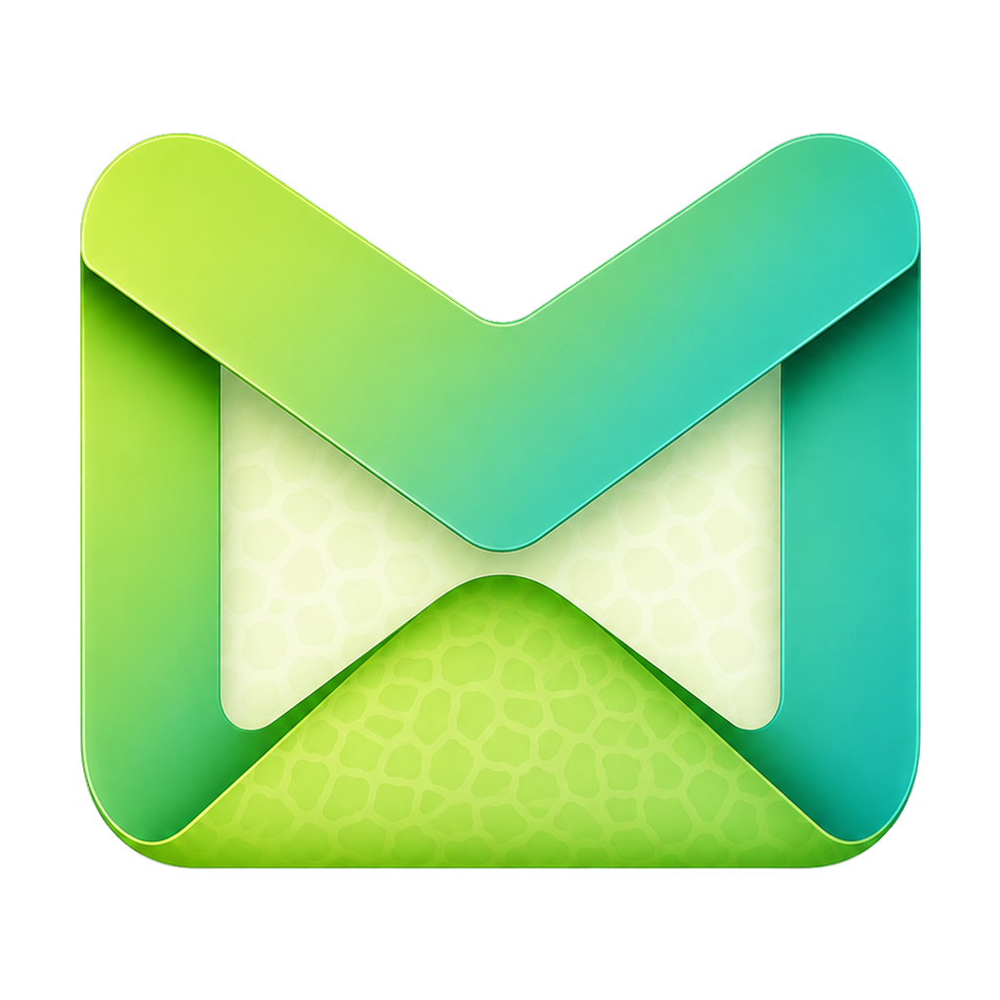

<h1 align="center">Meron</h1>

  
Messages that spark joy

  

Meron is a fast/secure email app with chat and kanban view.

Install from Microsoft Store, Snap Store, Google Play, App Store, or download installers from GitHub.

## Screenshots

| Unified inbox | Kanban board |
| --- | --- |
|  |  |

| Media gallery | Media grid |
| --- | --- |
|  |  |

| Themes |
| --- |
|  |

## Features

- **Email** over IMAP/SMTP, with threaded conversations and a rich-text composer
- **RSS / Atom feeds** alongside your mail
- **OAuth** sign-in (e.g. Gmail) plus password auth with mailbox autodiscovery
- **Encrypted local storage** (SQLite via SQLCipher), with credentials kept in
  the OS keyring
- **Native notifications**, system tray, and `mailto:` handling on desktop
- **Push notifications** on mobile via IMAP IDLE
- **Localized** into 20+ languages (see [`locales/`](locales/))

## Architecture

| Component | Stack | Location |
| --- | --- | --- |
| Core engine | Rust | [`meron-core/`](meron-core/) |
| Desktop app | Go + Wails | root (`*.go`) |
| Desktop UI | React + TypeScript + Tailwind | [`frontend/`](frontend/) |
| Mobile apps | Kotlin Multiplatform (Android/iOS) | [`mobile/`](mobile/) |

The Rust core runs as a sidecar process on desktop (driven over JSON-lines
stdio) and is linked directly into the mobile apps over FFI/JNI. This keeps all
mail, feed, and storage logic in one place across every platform.

## Development

See [CONTRIBUTING.md](CONTRIBUTING.md) for prerequisites and instructions on
building, testing, and translating Meron.

## License

Meron is licensed under the [GNU Affero General Public License v3.0](LICENSE).

Copyright © 2026 Nonbili Inc.
