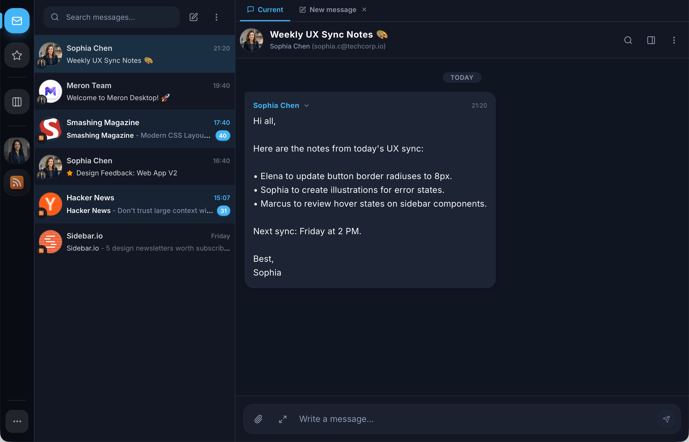
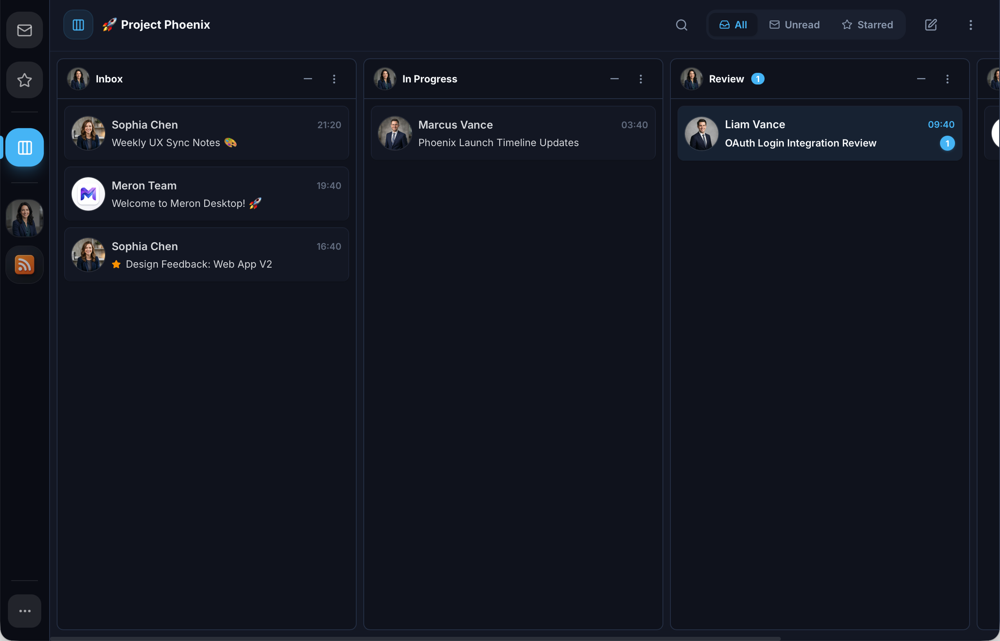
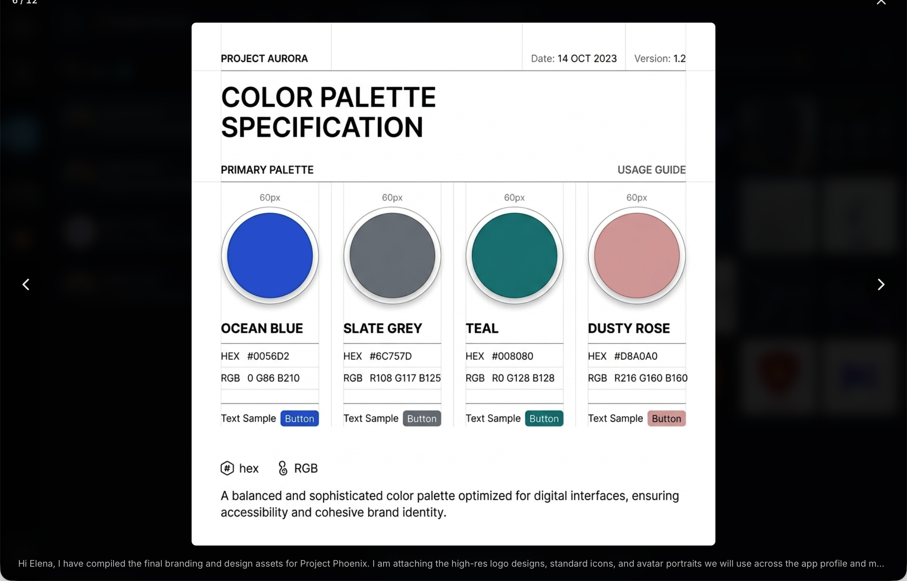
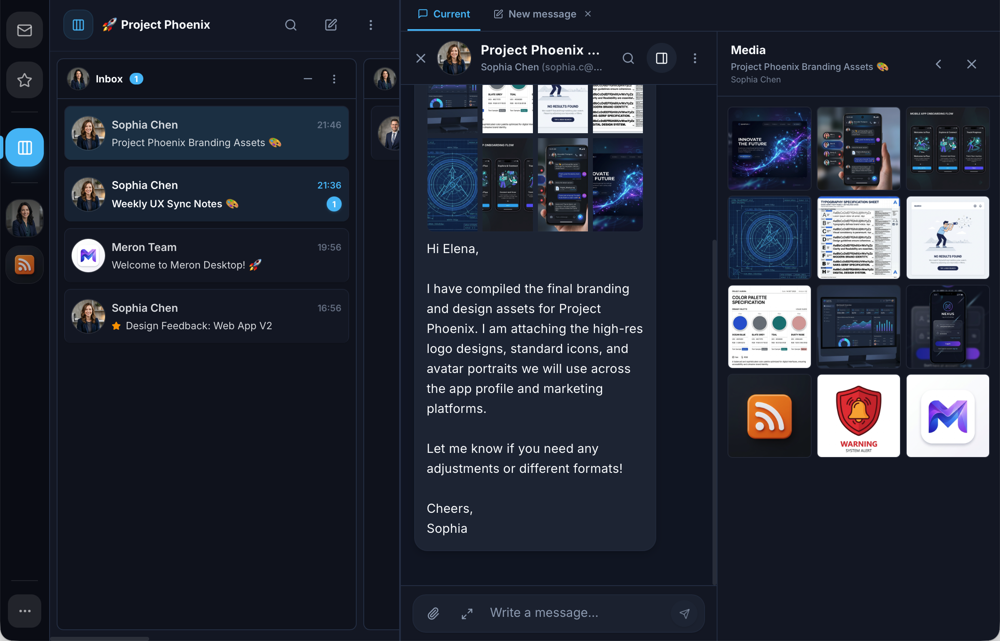
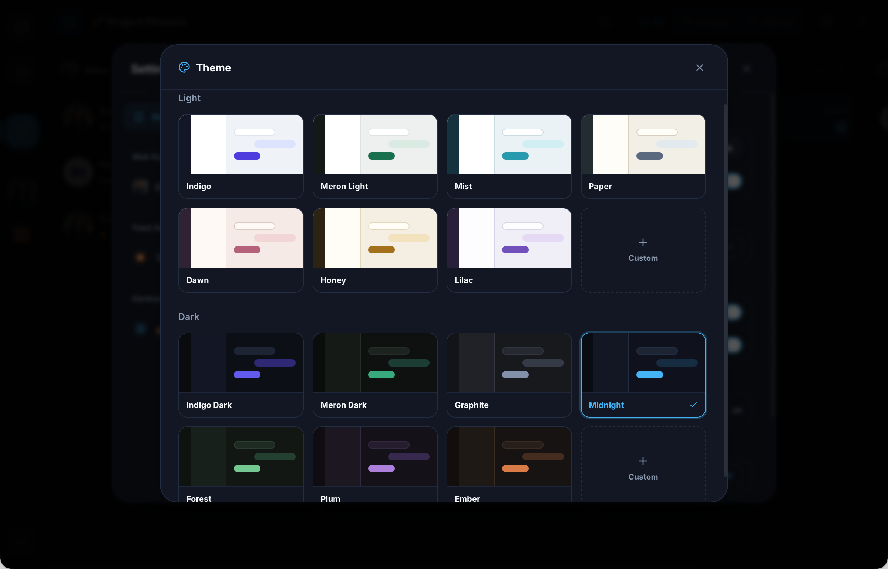

<h1 align="center">Meron</h1>

  
Messages that spark joy

  

Meron is a fast and secure email app with chat and kanban views.

Install from Microsoft Store, Flathub, Snap Store, Google Play, App Store, or download installers from GitHub.

AppImage notes

The Linux AppImage and tarball use the system WebKit, so they need
`webkit2gtk-4.1` installed (`libwebkit2gtk-4.1-0` on Debian/Ubuntu,
`webkit2gtk4.1` on Fedora, `webkit2gtk-4.1` on Arch). The Flatpak and snap
bundle their own and need nothing extra.

The AppImage carries update information and ships an accompanying
`meron-linux-amd64.AppImage.zsync`, so AppImageUpdate, AppImageLauncher, AM and
similar tools can update it by downloading only the changed blocks. The in-app
updater works as well and always fetches the full image.

## Screenshots

| Unified inbox | Kanban board |
| --- | --- |
|  |  |

| Media gallery | Media grid |
| --- | --- |
|  |  |

| Themes |
| --- |
|  |

## Features

- Unified Inbox, kanban and chat views
- IMAP/SMTP email and RSS/Atom feeds ([Exchange via DavMail](docs/exchange-davmail.md))
- Threaded conversations with rich-text composing and media galleries
- Easy setup with OAuth or automatic mailbox discovery
- Encrypted local storage with credentials kept in the OS keyring
- Themes and 20+ languages

## Architecture

| Component | Stack | Location |
| --- | --- | --- |
| Core engine | Rust | [`meron-core/`](meron-core/) |
| Desktop app | Go + Wails | [`desktop/`](desktop/) |
| Desktop UI | React + TypeScript + Tailwind | [`desktop/frontend/`](desktop/frontend/) |
| Mobile apps | Kotlin Multiplatform (Android/iOS) | [`mobile/`](mobile/) |

The Rust core runs as a sidecar process on desktop (driven over JSON-lines
stdio) and is linked directly into the mobile apps over FFI/JNI. This keeps all
mail, feed, and storage logic in one place across every platform.

## Development

See [CONTRIBUTING.md](CONTRIBUTING.md) for prerequisites and instructions on
building, testing, and translating Meron.

## License

Meron is licensed under the [GNU Affero General Public License v3.0](LICENSE).

Copyright © 2026 Nonbili Inc.
